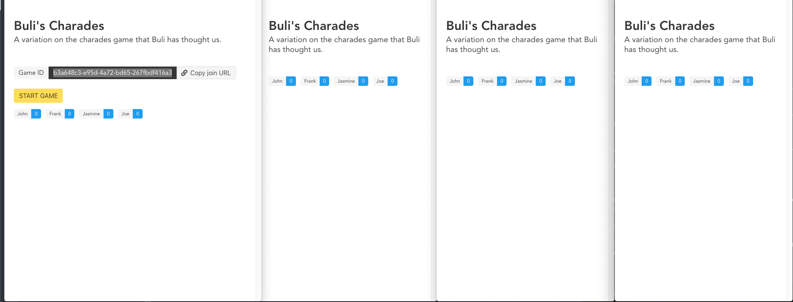
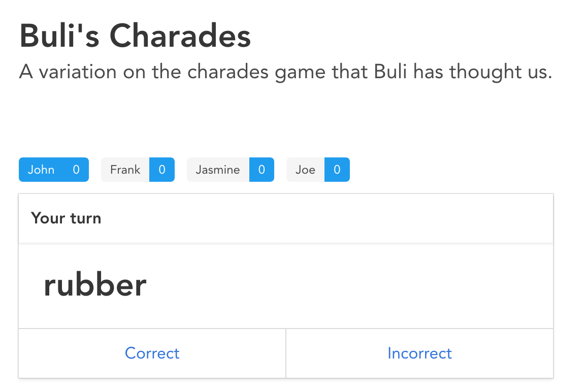

# Buli's Charades

Online multiplayer version of the charades/word-bowl game. Try it [online](https://toteto.github.io/charades/).

## How to play

### Original offline version

1. Each player writes certain amount of words and puts them in a "bowl".
2. The players are divided in teams (of 2 players but could be more).
3. On a player turn he picks a word from the bowl and tries to explain that word to the team members, following the round rules:
   - Round 1: Explain the word by using 1 sentence.
   - Round 2: Explain the word by using 1 word.
   - Round 3: Explain using only pantomime (body gestures, no words, no sounds).
4. The other team members has only 1 try to guess the word.
   - Guesses right, he scores (1 point = 1 word).
   - Guesses wrong, the word is returned to the bowl.
5. When all the words from the bowl are used, score is saved and all the words are returned to the bowl. Proceed to next round.

### Online version

Make sure to read how the original offline version is player before reading how to play the online.

1. A host inputs his name and words that want to be included in the game and click on the 'Host new game' button.
2. The 'Game ID' is shown and is shared among the other players.
3. Other players input their name, words and Game ID into the fields and click on the 'Join' button.
4. Once all the players have joined, the host clicks on the 'START GAME' button.
   
5. Game is played, on each player turn he can explain (**recommended via video call**) to the other team member and click on the 'Correct' or 'Incorrect' action buttons, marking that word as correctly guessed or not.
   
6. When all the words are used, the host can start the next round. The score next to each player is accumulated between rounds.

## Inspiration

During the boredom of the quarantine of COVID-19 me and group of friends wanted to play charades but were unable to find online multiplayer version that satisfied our needs. The idea was born, the implementation is me trying new (to me) web technologies.

## Technical documentation

### Frontend

- [Vue.js](https://vuejs.org/) - Web framework
- [Bulma](https://bulma.io/) + [Buefy](https://buefy.org/) - Lightweight UI components for Vue.js based on Bulma
- [PeerJS](https://peerjs.com/) - Wrapper around the WebRTC browser implementation for easier usage of the peer-to-peer protocol.

#### Project setup

```
npm install -g @vue/cli
git clone https://github.com/toteto/charades.git
yarn
```

#### Development (compilation and hot-reloads)

```
yarn serve
```

#### Deployment

```
sh ./deploy.sh
```

### Backend

- [PeerServer](https://github.com/peers/peerjs-server) - The signaling server used for PeerJS peers to be able to connect to each other.

I have hosted PeerServer on AWS, you can access it on https://peerjs-server.toteto.tech:9443. Make sure to use proper PeerJS configuration if you want to use. Check [my configuration](./src/js/utils.js).

Small modification was made to the `Dockerfile` in order to do proper SSL, path and port configuration , check it out on [toteto/peerjs-server](https://github.com/toteto/peerjs-server).
